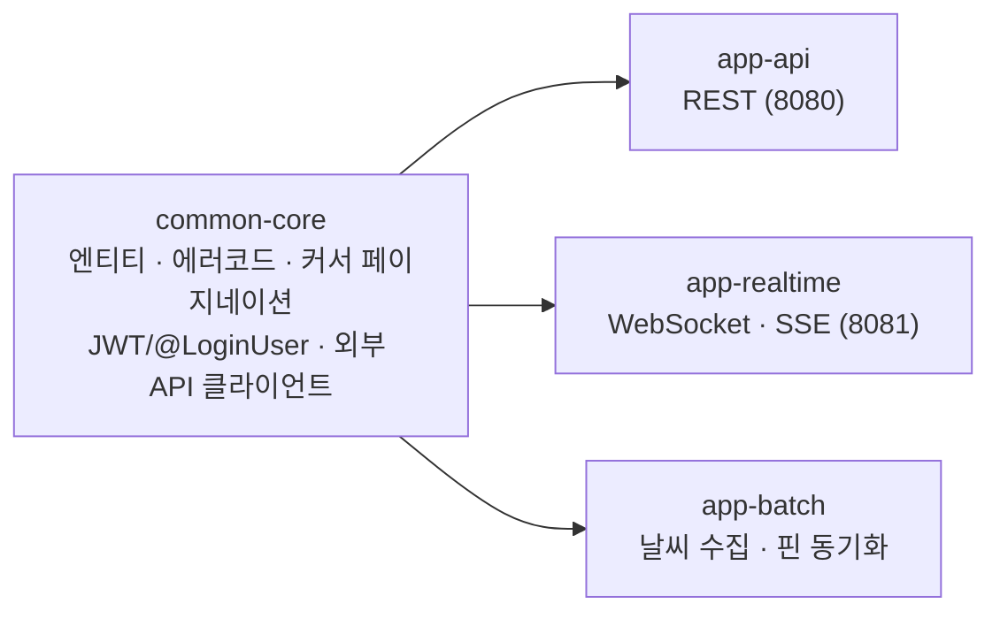
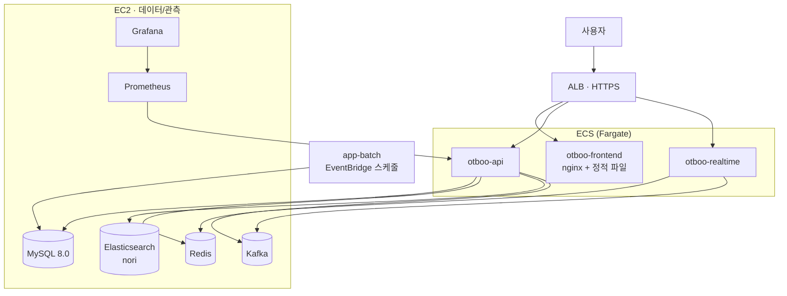

# 옷장을 부탁해 (otboo)

> 오늘 날씨에 맞는 옷을, **내 옷장 안에서** 골라주는 서비스

[](https://github.com/otboo-team2/sb12-otboo-team2/actions/workflows/ci.yml)
[](https://github.com/otboo-team2/sb12-otboo-team2/actions/workflows/ci-frontend.yml)

**🔗 배포 주소 — https://otboo.xyz**

코드잇 스프린트 백엔드 12기 파이널 프로젝트 · 2026.08.25 ~ 2026.10.02 · 5인

---

## 목차

- [무엇을 만들었나](#무엇을-만들었나)
- [AI 기능](#ai-기능)
- [아키텍처](#아키텍처)
- [기술 스택](#기술-스택)
- [기술적 선택과 근거](#기술적-선택과-근거)
- [로컬 실행](#로컬-실행)
- [팀](#팀)

---

## 무엇을 만들었나

날씨 앱은 "오늘 15도"라고 알려주지만, 사람이 궁금한 건 **"그래서 뭘 입지"** 다.
otboo는 사용자가 등록한 **자기 옷장**과 **실시간 날씨**를 엮어, 오늘 입을 조합을 추천한다.

| 영역 | 기능 |
|---|---|
| **옷장** | 의상 등록·수정·삭제, 동적 속성(EAV), 즐겨찾기, **상품 링크 → 속성 자동 입력** |
| **날씨** | 지역별 단기예보 수집 배치, 기온·강수·체감 보정 |
| **추천** | 날씨 기반 규칙 추천, **자연어 프롬프트 기반 AI 추천**, 코디 레퍼런스 |
| **피드** | OOTD 등록, 좋아요·댓글, 팔로우, **형태소 분석 기반 검색** |
| **실시간** | DM(WebSocket·STOMP), 알림(SSE) |
| **계정** | 이메일 가입, **소셜 로그인(Google·Kakao)**, 비밀번호 초기화, 어드민 권한·잠금 |
| **가상 피팅** | 모델 이미지 + 내 옷 → AI 합성 (비동기 잡 + 폴링) |

REST 컨트롤러 19개, Flyway 마이그레이션 V1~V7.

---

## AI 기능

외부 AI를 네 군데에 쓴다. **전부 공통 클라이언트를 거친다** — 타임아웃·재시도·**일일 호출 상한**·마스킹 로깅이 한 곳에 있다. 크레딧이 날아가면 발표 전에 복구가 안 되기 때문이다.

### 1. 상품 링크 → 의상 속성 자동 입력 (Gemini)

무신사·29CM 같은 상품 페이지 URL을 붙여넣으면 의상 정보가 자동으로 채워진다.

```
URL → HTML·Next.js Flight 데이터 파싱 → 상품 이미지 후보 추출
    → OpenCV(DB18) 텍스트 영역 검출로 "상세컷"만 선별
    → Gemini 멀티모달 호출 → 이름·종류·속성 추출
```

이미지를 전부 보내면 비용이 터지므로, **후보 200개 중 전체 위치를 고르게 보존해 6장만** 고른다. 페이지 텍스트도 15,000자에서 자른다.

### 2. 자연어 AI 추천 (OpenAI + Elasticsearch RAG)

> "내일 면접인데 단정하게"

```
프롬프트 → 조건 추출(Tool Calling) → 쿼리 임베딩
        → 내 옷 후보 안에서 kNN 벡터 검색(Elasticsearch)
        → 소유권 재검증 → 생성 → 추천 + 추천 이유
```

생성 결과를 **그대로 믿지 않는다.** ⓐ 내가 준 후보 안에 있는지 ⓑ 제외 요청한 옷이 섞이지 않았는지 ⓒ `DRESS + TOP/BOTTOM` 같은 불가능한 조합이 아닌지 — 셋 다 통과해야 응답에 나간다. 하나라도 틀리면 규칙 기반 추천으로 떨어진다.

### 3. 가상 피팅 (FASHN)

생성에 10초~2분이 걸려 HTTP 요청 하나로 기다릴 수 없다. **잡 테이블 + 폴링**으로 비동기 처리하고, 상·하의·액세서리를 **단계별로 합성**한다. 같은 조합은 캐시에서 재사용해 호출을 건너뛴다.

### 4. 코디 레퍼런스 (Pinterest)

추천 시점에 Pinterest를 부르지 않는다. **배치가 큐레이션 보드의 핀을 미리 수집**해 DB에 넣고, 추천은 그 테이블에서 찾는다. 핀 설명의 `@otboo temp:5-8 sky:cloudy style:minimal` 태그를 파싱해 기온·날씨·스타일로 색인한다.

---

## 아키텍처

### 모듈



앱 셋이 **별도 JVM**이라 도메인 이벤트·엔티티는 반드시 `common-core`에 둔다. 공통을 복사하면 양쪽이 서로 다른 클래스를 보게 된다.

### 배포



- **프론트가 같은 오리진에서 API를 리버스 프록시한다.** 오리진이 갈리면 리프레시 토큰 쿠키(`SameSite=Lax`)가 따라가지 않고 OAuth 콜백도 돌아올 곳을 잃는다.
- 이미지는 **GHCR → ECR**로 복사해 ECS가 당겨간다. 태그는 브랜치명과 커밋 해시 둘 다 붙여, 롤백할 때 무엇으로 돌아가는지 분명하게 한다.

---

## 기술 스택

| 구분 | 사용 |
|---|---|
| 언어·프레임워크 | Java 21, Spring Boot 3.5.16 (Gradle 멀티모듈) |
| 데이터 | MySQL 8.0 + Flyway, Redis 7, Elasticsearch 8.18.8 (nori) |
| 메시징 | Kafka 4.3.1 (+ Transactional Outbox) |
| 인증 | JWT (Access 30분 / Refresh 14일 회전), OAuth2 (Google·Kakao) |
| 실시간 | STOMP over WebSocket, SSE |
| 외부 AI | OpenAI, Google Gemini, FASHN, Pinterest API |
| 테스트 | JUnit 5, **Testcontainers**, JaCoCo (전체 합산 리포트) |
| 관측 | Micrometer, Prometheus, Grafana, k6 |
| 배포 | GitHub Actions, GHCR·ECR, ECS, ALB, EventBridge Scheduler |

---

## 기술적 선택과 근거

### 시간은 전부 UTC — 다섯 지점에 못 박았다

MySQL 서버 · 컨테이너 TZ · JDBC `serverTimezone` · Hibernate `jdbc.time_zone` · JVM `user.timezone`.
한 군데만 빠져도 **테스트는 통과하고 운영에서 9시간 어긋난다.** 엔티티 시간 타입은 전부 `Instant`이고 `LocalDateTime`은 쓰지 않는다. DDL도 `TIMESTAMP` 대신 `DATETIME(6)`을 쓴다 — `TIMESTAMP`는 세션 타임존에 따라 자동 변환돼 이 규칙을 조용히 우회한다.

### 테스트 DB는 H2가 아니라 Testcontainers

RDB를 MySQL로 확정한 이상 H2는 방언이 달라 JSON 함수·`ON DUPLICATE KEY`를 못 쓴다. **테스트만 통과하고 운영에서 깨지는** 상황을 피하려고 실제 MySQL 컨테이너를 띄운다. Redis·Elasticsearch도 같다.

### 커서 페이지네이션에 타이브레이크를 강제했다

`likeCount` 같은 정렬 키는 **값이 변하고 중복된다.** 정렬 키 하나만 커서로 쓰면 페이지 경계에서 항목이 사라지거나 두 번 나온다. 그래서 `(정렬키, id)` 복합 커서를 공통 모듈에 넣고 모든 목록이 쓰게 했다.

### 위조 가능한 식별자는 요청 본문에서 받지 않는다

API 스펙이 `authorId`·`ownerId`를 request body에 두고 있다. 그대로 믿으면 **남의 이름으로 글을 쓸 수 있다(IDOR).** `@LoginUser AuthPrincipal`로 인증 주체를 주입받아 대조하고, 위조 차단을 테스트로 증명한다.

### 외부 AI 호출은 공통 클라이언트를 통과해야만 한다

타임아웃·재시도·**일일 호출 상한**·URL 마스킹 로깅이 한 곳에 있다. 재시도 기본값은 **0** — 재시도가 안전한(재호출해도 과금·중복 생성이 없는) API만 담당자가 올린다. 모든 호출은 성공·실패·상한초과가 전부 한 줄로 남아, 로그만 보고 "AI가 실제로 불렸는가"를 판정할 수 있다.

### 측정하지 않은 최적화는 넣지 않는다

의상 속성 **N+1**과 피드 `totalCount`의 `count(*)`는 **의도적으로 남겨둔 측정 대상**이다. before 수치가 사라지면 개선을 증명할 수 없다. 고칠 때는 고치기 전 쿼리 수·응답시간을 먼저 기록하고 PR 본문에 남긴다.

---

## 로컬 실행

```bash
cp .env.example .env          # 최초 1회
docker compose up -d          # mysql · redis · kafka · elasticsearch · prometheus · grafana
./gradlew :app-api:bootRun
```

```bash
./gradlew build               # 테스트 포함 (Docker 필요)
./gradlew coverageReport      # 전체 모듈 합산 커버리지
```

| 주소 | |
|---|---|
| http://localhost:5173 | 프론트 |
| http://localhost:8080 | API |
| http://localhost:3000 | Grafana |
| http://localhost:9090/targets | Prometheus (`otboo-api` UP 확인) |

> **스키마는 Flyway만 건드린다.** `ddl-auto: validate`라 엔티티와 스키마가 어긋나면 앱이 아예 뜨지 않는다.
> 마이그레이션을 추가했다면 `docker compose down -v && docker compose up -d`로 로컬 DB를 새로 만든다.

외부 AI 키(`OPENAI_API_KEY`·`GEMINI_API_KEY`·`FASHN_API_KEY`·`PINTEREST_ACCESS_TOKEN`)는 **없어도 앱은 뜬다.** 해당 기능을 호출하는 순간에만 실패한다.

---

## 팀

| 이름 | GitHub | 담당 |
|---|---|---|
| **여운정** (팀장) | [@novafterg1ow](https://github.com/novafterg1ow) | 공통 모듈 · 인증/보안 · CI/CD · 사용자/프로필 |
| 박교현 | [@hyeon2628](https://github.com/hyeon2628) | 날씨 수집 배치 · AI 추천(RAG) |
| 류승지 | [@lyoonat](https://github.com/lyoonat) | 피드·좋아요·댓글 · 팔로우 · 검색(ES) · Pinterest |
| 안소현 | [@SHAhn1111](https://github.com/SHAhn1111) | 의상/옷장 · 링크 추출 · 추출 모니터링 |
| 양정우 | [@ozingeodari](https://github.com/ozingeodari) | 알림 · DM · WebSocket/SSE · 가상 피팅 |

### 협업 방식

- **브랜치** `feature/*` → `int` → `dev` → `main`
- **PR** 승인 2명 필수, 두 번째 승인자가 머지. 리뷰 코멘트에 **심각도(P1/P2/P3)** 와 `파일:줄번호` 표기
- **데일리** 10:00 스크럼 · 17:30 PR 의무 등록 · 18:00 공유
- API 스펙은 [`docs/otboo-openapi.json`](docs/otboo-openapi.json)
